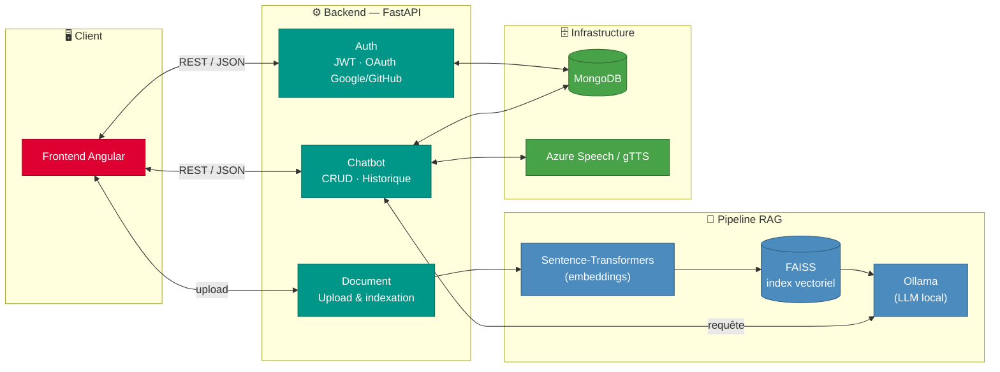

# 🧠 Chatbot as a Service — Plateforme RAG multi-utilisateurs

[](https://fastapi.tiangolo.com)
[](https://angular.io)
[](https://www.mongodb.com)
[](https://github.com/facebookresearch/faiss)
[](https://www.docker.com)
[](LICENSE)

> Plateforme permettant à chaque utilisateur de créer son propre **chatbot intelligent** connecté à ses documents (PDF/TXT), grâce à une architecture **RAG (Retrieval-Augmented Generation)**. Support du texte et de la voix (reconnaissance et synthèse vocale).

---

## 📋 Sommaire

- [Fonctionnalités](#-fonctionnalités)
- [Architecture](#-architecture)
- [Stack technique](#-stack-technique)
- [Sécurité & configuration](#-sécurité--configuration)
- [Installation & Lancement](#-installation--lancement)
- [Structure du projet](#-structure-du-projet)
- [Auteur](#-auteur)

---

## ✨ Fonctionnalités

**Authentification**
- Inscription / connexion classique (JWT)
- OAuth Google / GitHub
- Gestion de l'avatar utilisateur

**Chatbots personnalisés**
- Création, modification, suppression de chatbots par utilisateur
- Chaque chatbot est isolé : son propre index vectoriel, son propre historique
- Upload de documents (PDF/TXT) comme base de connaissance

**RAG (Retrieval-Augmented Generation)**
- Indexation vectorielle des documents via **FAISS**
- Embeddings via **Sentence-Transformers**
- Génération de réponses contextualisées via **Ollama** (LLM local)

**Interaction vocale**
- Reconnaissance vocale et synthèse vocale (Azure Cognitive Services, gTTS)
- Conversion audio automatique (WAV 16kHz mono)

**Historique**
- Sauvegarde et consultation de l'historique des conversations par chatbot

---

## 🏗️ Architecture



Chaque utilisateur dispose de son propre espace : ses chatbots, ses documents indexés (un index FAISS distinct par chatbot), et son historique de conversation — isolation complète des données entre utilisateurs.

---

## 🛠️ Stack technique

**Backend**
- Python · FastAPI · Uvicorn
- MongoDB (persistance utilisateurs, chatbots, historique)
- FAISS (recherche vectorielle) · Sentence-Transformers (embeddings)
- Ollama (LLM auto-hébergé)
- JWT · OAuth2 (Google, GitHub)
- Azure Cognitive Services Speech · gTTS · pydub

**Frontend**
- Angular · TypeScript

**Infra**
- Docker / Docker Compose (MongoDB + Ollama + API)

---

## 🔐 Sécurité & configuration

Toutes les valeurs sensibles sont chargées via variables d'environnement (`python-dotenv`), jamais codées en dur. Un fichier d'exemple est fourni : [`backend/.env.example`](backend/.env.example).

```bash
cp backend/.env.example backend/.env
# → renseigner tes propres valeurs (clé API, base de données, secret JWT...)
```

> ⚠️ **Points à durcir avant un déploiement en production** :
> - Remplacer les valeurs par défaut de `SECRET_KEY` / `SESSION_SECRET_KEY` (actuellement des valeurs de repli codées en dur dans `config.py`/`main.py`) par des secrets forts générés aléatoirement, exigés en variable d'environnement.
> - Restreindre `CORSMiddleware(allow_origins=["*"])` aux domaines réels du frontend en production.

---

## ⚙️ Installation & Lancement

### Avec Docker (recommandé)
```bash
docker-compose up --build
# API disponible sur http://localhost:8000
```

### Backend en local
```bash
cd backend
python -m venv venv
source venv/bin/activate  # Windows : venv\Scripts\activate
pip install -r requirements.txt
cp .env.example .env      # puis renseigner les valeurs
uvicorn app.main:app --reload
```

### Frontend
```bash
cd frontend/chatbot-frontend
npm install
ng serve
# Application disponible sur http://localhost:4200
```

---

## 📁 Structure du projet

```
Chatbot-as-a-service/
├── backend/
│   ├── app/
│   │   ├── api/            # auth.py · chatbot.py · document.py
│   │   ├── core/           # config.py · jwt.py · oauth.py · database.py
│   │   ├── models/         # user.py · chatbot.py · document.py · ask.py
│   │   ├── services/       # rag_service, chatbot_service, history_service
│   │   └── main.py
│   ├── scripts/
│   ├── .env.example
│   └── Dockerfile
└── frontend/
    └── chatbot-frontend/   # Application Angular
        └── src/app/
```


---

## 👤 Auteur

**Cherni Mohamed Amine**
Élève-ingénieur en Génie Informatique (Data Science & IA) — Université Centrale Tunisie

- 🔗 [LinkedIn](https://www.linkedin.com/in/cherni-mohamed-amine-40158b2b1/)
- 💻 [GitHub](https://github.com/cherniamine)

---

## 📄 License

Ce projet est distribué sous licence MIT — voir le fichier [LICENSE](LICENSE) pour plus de détails.