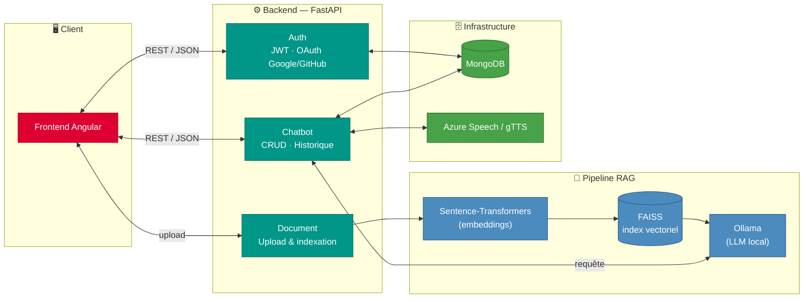
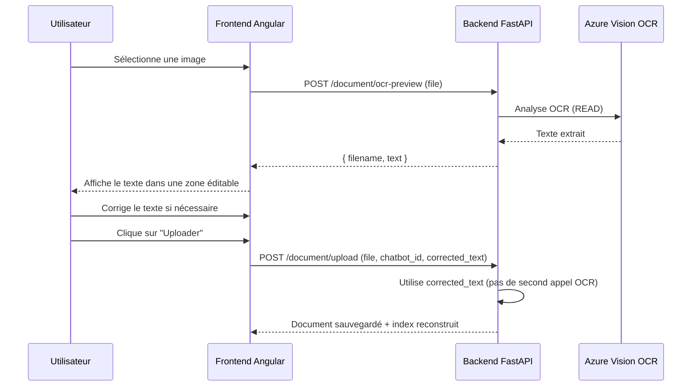

# 🧠 Chatbot as a Service — Plateforme RAG multi-utilisateurs

[](https://fastapi.tiangolo.com)
[](https://angular.io)
[](https://www.mongodb.com)
[](https://github.com/facebookresearch/faiss)
[](https://www.docker.com)
[](LICENSE)

> Plateforme permettant à chaque utilisateur de créer son propre **chatbot intelligent** connecté à ses documents (PDF, DOCX, TXT, CSV, XLSX, PPTX, images...), grâce à une architecture **RAG (Retrieval-Augmented Generation)**. Support du texte, de la voix (reconnaissance et synthèse vocale) et de l'image (OCR).

---

## 📋 Sommaire

- [Fonctionnalités](#-fonctionnalités)
- [Architecture](#-architecture)
- [OCR Preview](#-ocr-preview--aperçu-et-correction-avant-upload)
- [Stack technique](#-stack-technique)
- [Sécurité & configuration](#-sécurité--configuration)
- [Endpoints API — Documents](#-endpoints-api--documents)
- [Installation & Lancement](#-installation--lancement)
- [Structure du projet](#-structure-du-projet)
- [Auteur](#-auteur)

---

## ✨ Fonctionnalités

**Authentification**
- Inscription / connexion classique (JWT)
- OAuth Google / GitHub
- Gestion de l'avatar utilisateur

**Chatbots personnalisés**
- Création, modification, suppression de chatbots par utilisateur
- Chaque chatbot est isolé : son propre index vectoriel, son propre historique
- Upload de documents (PDF, DOCX, TXT, CSV, XLSX, PPTX, images) comme base de connaissance

**RAG (Retrieval-Augmented Generation)**
- Indexation vectorielle des documents via **FAISS**
- Embeddings via **Sentence-Transformers**
- Génération de réponses contextualisées via **Ollama** (LLM local)

**OCR Preview (images)**
- Avant l'upload définitif, toute image sélectionnée passe par un aperçu OCR
- L'utilisateur voit et peut **corriger** le texte extrait avant qu'il soit indexé
- Formats supportés : JPG, JPEG, PNG, BMP, TIFF/TIF, WEBP

**Interaction vocale**
- Reconnaissance vocale et synthèse vocale (Azure Cognitive Services, gTTS)
- Conversion audio automatique (WAV 16kHz mono)

**Historique**
- Sauvegarde et consultation de l'historique des conversations par chatbot

---

## 🏗️ Architecture


```mermaid
flowchart LR
    subgraph Client["🖥️ Client"]
        FE["Frontend Angular"]
    end

    subgraph API["⚙️ Backend — FastAPI"]
        direction TB
        AUTH["Auth<br/>JWT · OAuth Google/GitHub"]
        CHAT["Chatbot<br/>CRUD · Historique"]
        DOC["Document<br/>Upload & indexation"]
    end

    subgraph RAG["🔎 Pipeline RAG"]
        direction TB
        EMB["Sentence-Transformers<br/>(embeddings)"]
        VEC[("FAISS<br/>index vectoriel")]
        LLM["Ollama<br/>(LLM local)"]
        EMB --> VEC --> LLM
    end

    subgraph Infra["🗄️ Infrastructure"]
        DB[("MongoDB")]
        VOICE["Azure Speech / gTTS"]
    end

    FE <-->|"REST / JSON"| AUTH
    FE <-->|"REST / JSON"| CHAT
    FE <-->|"upload"| DOC
    DOC --> EMB
    CHAT <-->|"requête"| LLM
    CHAT <--> VOICE
    AUTH <--> DB
    CHAT <--> DB

    classDef client fill:#DD0031,color:#fff,stroke:#a80025
    classDef api fill:#009688,color:#fff,stroke:#00695c
    classDef rag fill:#4B8BBE,color:#fff,stroke:#2c5a82
    classDef infra fill:#47A248,color:#fff,stroke:#2f6b30

    class FE client
    class AUTH,CHAT,DOC api
    class EMB,VEC,LLM rag
    class DB,VOICE infra
```

Chaque utilisateur dispose de son propre espace : ses chatbots, ses documents indexés (un index FAISS distinct par chatbot), et son historique de conversation — isolation complète des données entre utilisateurs.

---

## 🔍 OCR Preview — aperçu et correction avant upload

Lorsqu'un utilisateur sélectionne une **image** (JPG, JPEG, PNG, BMP, TIFF/TIF, WEBP) comme document à ajouter à un chatbot, le frontend déclenche automatiquement un appel à l'endpoint d'aperçu OCR **avant** l'upload définitif. Cela permet de vérifier — et au besoin de corriger — le texte détecté avant qu'il ne soit découpé en chunks et indexé dans FAISS.

### Fonctionnement


```mermaid
sequenceDiagram
    participant U as Utilisateur
    participant FE as Frontend Angular
    participant API as Backend FastAPI
    participant AZ as Azure Vision OCR

    U->>FE: Sélectionne une image
    FE->>API: POST /document/ocr-preview (file)
    API->>AZ: Analyse OCR (READ)
    AZ-->>API: Texte extrait
    API-->>FE: { filename, text }
    FE-->>U: Affiche le texte dans une zone éditable
    U->>FE: Corrige le texte si nécessaire
    U->>FE: Clique sur "Uploader"
    FE->>API: POST /document/upload (file, chatbot_id, corrected_text)
    API->>API: Utilise corrected_text (pas de second appel OCR)
    API-->>FE: Document sauvegardé + index reconstruit
```

Points clés :
- L'appel `/document/ocr-preview` **n'écrit rien en base** — c'est un aperçu pur.
- Si l'utilisateur corrige le texte, la version corrigée est envoyée dans le champ `corrected_text` lors de l'upload final, ce qui **évite un second appel OCR** redondant et garantit que c'est bien le texte validé par l'utilisateur qui est indexé.
- Si `corrected_text` n'est pas fourni (ou que le fichier n'est pas une image), le comportement historique est conservé : extraction automatique via `extract_text()`.

### Formats d'image supportés

| Extension | Supporté |
|---|---|
| `.jpg` / `.jpeg` | ✅ |
| `.png` | ✅ |
| `.bmp` | ✅ |
| `.tiff` / `.tif` | ✅ |
| `.webp` | ✅ |

### Variables d'environnement requises

L'OCR repose sur **Azure AI Vision** (fonctionnalité *Read*). Dans `backend/.env` :

```bash
AZURE_VISION_ENDPOINT=https://<votre-ressource>.cognitiveservices.azure.com/
AZURE_VISION_KEY=<votre-clé-azure-vision>
```

Sans ces variables, les appels OCR (preview et upload direct d'image) échouent avec une erreur explicite invitant à configurer `.env`.

### Exemple d'utilisation (API)

```bash
# 1. Aperçu OCR (sans sauvegarde)
curl -X POST http://localhost:8000/document/ocr-preview \
  -H "Authorization: Bearer <votre_token_jwt>" \
  -F "file=@facture.png"

# Réponse :
# { "filename": "facture.png", "text": "Facture n°1234\nTotal: 150.00 TND\n..." }

# 2. Upload définitif avec texte corrigé
curl -X POST http://localhost:8000/document/upload \
  -H "Authorization: Bearer <votre_token_jwt>" \
  -F "chatbot_id=64f1a2b3c4d5e6f7a8b9c0d1" \
  -F "file=@facture.png" \
  -F "corrected_text=Facture n°1234\nTotal: 150,00 TND\n..."
```

---

## 🛠️ Stack technique

**Backend**
- Python · FastAPI · Uvicorn
- MongoDB (persistance utilisateurs, chatbots, historique)
- FAISS (recherche vectorielle) · Sentence-Transformers (embeddings)
- Ollama (LLM auto-hébergé)
- JWT · OAuth2 (Google, GitHub)
- Azure Cognitive Services Speech · gTTS · pydub

**Frontend**
- Angular · TypeScript

**Infra**
- Docker / Docker Compose (MongoDB + Ollama + API)

---

## 🔐 Sécurité & configuration

Toutes les valeurs sensibles sont chargées via variables d'environnement (`python-dotenv`), jamais codées en dur. Un fichier d'exemple est fourni : [`backend/.env.example`](backend/.env.example).

```bash
cp backend/.env.example backend/.env
# → renseigner tes propres valeurs (clé API, base de données, secret JWT...)
```

> ⚠️ **Points à durcir avant un déploiement en production** :
> - Remplacer les valeurs par défaut de `SECRET_KEY` / `SESSION_SECRET_KEY` (actuellement des valeurs de repli codées en dur dans `config.py`/`main.py`) par des secrets forts générés aléatoirement, exigés en variable d'environnement.
> - Restreindre `CORSMiddleware(allow_origins=["*"])` aux domaines réels du frontend en production.
> - `AZURE_VISION_ENDPOINT` / `AZURE_VISION_KEY` sont requis pour toute fonctionnalité OCR (upload d'image et OCR Preview) — voir la section [OCR Preview](#-ocr-preview--aperçu-et-correction-avant-upload).

---

## 📡 Endpoints API — Documents

| Méthode | Endpoint | Description |
|---|---|---|
| `POST` | `/document/ocr-preview` | Extrait le texte d'une image via OCR, sans sauvegarde (aperçu) |
| `POST` | `/document/upload` | Upload d'un document (accepte `corrected_text` optionnel pour les images) |
| `GET` | `/document/list` | Liste les documents d'un chatbot |
| `DELETE` | `/document/{document_id}` | Supprime un document |

---

## ⚙️ Installation & Lancement

### Avec Docker (recommandé)
```bash
docker-compose up --build
# API disponible sur http://localhost:8000
```

### Backend en local
```bash
cd backend
python -m venv venv
source venv/bin/activate  # Windows : venv\Scripts\activate
pip install -r requirements.txt
cp .env.example .env      # puis renseigner les valeurs
uvicorn app.main:app --reload
```

### Frontend
```bash
cd frontend/chatbot-frontend
npm install
ng serve
# Application disponible sur http://localhost:4200
```

---

## 📁 Structure du projet

```
Chatbot-as-a-service/
├── backend/
│   ├── app/
│   │   ├── api/            # auth.py · chatbot.py · document.py (upload, list, delete, ocr-preview)
│   │   ├── core/           # config.py · jwt.py · oauth.py · database.py
│   │   ├── models/         # user.py · chatbot.py · document.py · ask.py
│   │   ├── services/       # rag_service, chatbot_service, history_service
│   │   ├── utils/          # file_utils.py (extraction texte + OCR), auth_utils.py, avatar_util.py
│   │   └── main.py
│   ├── scripts/
│   ├── .env.example
│   └── Dockerfile
└── frontend/
    └── chatbot-frontend/   # Application Angular
        └── src/
            ├── app/
            │   ├── core/services/           # document.service.ts (upload, list, delete, ocrPreview)
            │   └── dashboard/pages/document/
            │       ├── document-upload/     # document-upload.ts/.html (sélection + preview OCR)
            │       └── document-list/
            └── assets/i18n/                 # fr.json · en.json · ar.json
```


---

## 👤 Auteur

**Cherni Mohamed Amine**
Élève-ingénieur en Génie Informatique (Data Science & IA) — Université Centrale Tunisie

- 🔗 [LinkedIn](https://www.linkedin.com/in/cherni-mohamed-amine-40158b2b1/)
- 💻 [GitHub](https://github.com/cherniamine)

---

## 📄 License

Ce projet est distribué sous licence MIT — voir le fichier [LICENSE](LICENSE) pour plus de détails.
